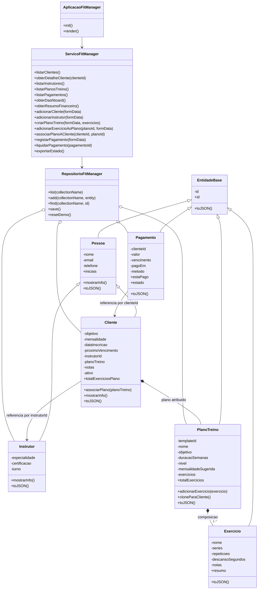
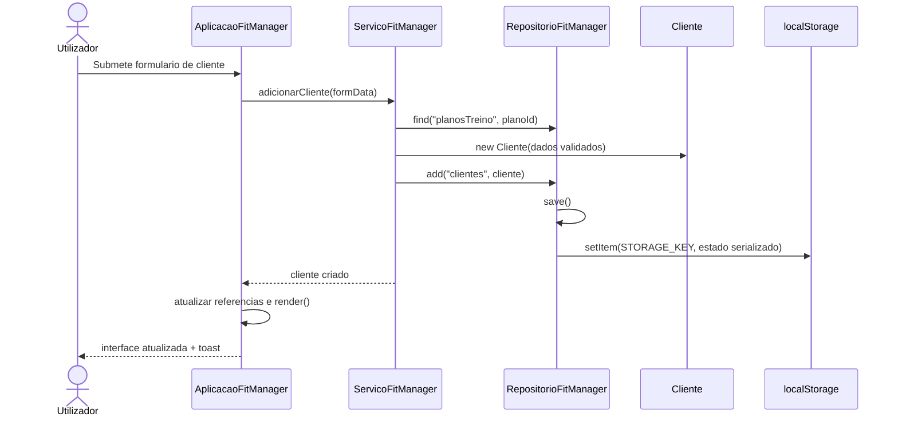
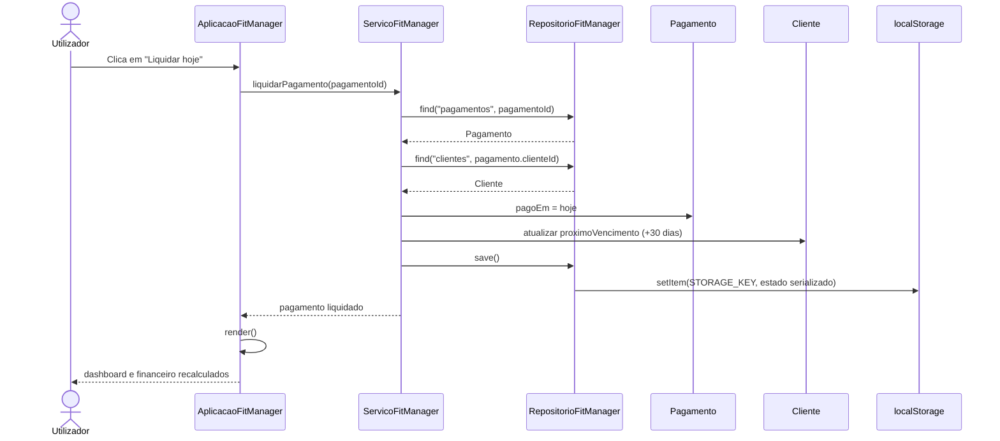
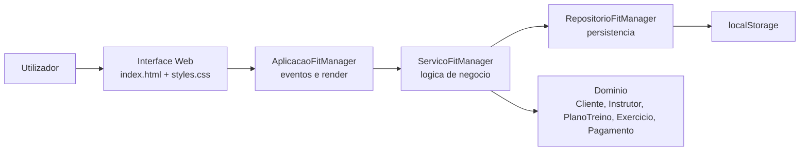

# Relatorio Tecnico de Analise de Sistemas

## Introducao

O projeto **FitManager** e uma aplicacao web cliente-side para gestao operacional de um ginasio. A solucao foi implementada com `HTML`, `CSS` e `JavaScript`, sem dependencias externas, e funciona diretamente no browser atraves do ficheiro `index.html`.

O objetivo principal da aplicacao e concentrar, numa unica interface, a gestao de clientes, instrutores, planos de treino e pagamentos. Do ponto de vista tecnico, o projeto demonstra conceitos de programacao orientada a objetos, persistencia local com `localStorage` e uma arquitetura simples em camadas dentro de uma Single Page Application.

## Analise de Contexto

### Problema a resolver

Um ginasio de pequena ou media dimensao precisa de acompanhar:

- clientes registados e respetivos objetivos;
- instrutores disponiveis e especialidades;
- planos de treino reutilizaveis;
- associacao de planos a clientes;
- controlo de mensalidades, pagamentos em atraso e receita recebida.

Sem um sistema centralizado, esta informacao tende a ficar dispersa, o que dificulta o acompanhamento comercial e tecnico do negocio.

### Contexto operacional

No estado atual, o FitManager foi desenhado para uso local no browser, com persistencia no `localStorage`. Isto significa que:

- nao existe backend nem base de dados remota;
- nao existe autenticacao de utilizadores;
- o sistema e orientado a um contexto de demonstracao, prototipo funcional ou projeto academico;
- o mesmo interface suporta tarefas administrativas e de acompanhamento tecnico.

### Stakeholders principais

- `Gestor/Rececao`: regista clientes, instrutores e pagamentos.
- `Instrutor`: consulta clientes, planos e informacao de treino.
- `Cliente`: nao interage diretamente com o sistema, mas os seus dados e pagamentos sao geridos pela aplicacao.

## Requisitos Funcionais e Nao Funcionais

### Requisitos Funcionais

- `RF01`: O sistema deve permitir registar novos clientes.
- `RF02`: O sistema deve permitir registar novos instrutores.
- `RF03`: O sistema deve permitir criar planos de treino com multiplos exercicios.
- `RF04`: O sistema deve permitir adicionar exercicios a planos ja existentes.
- `RF05`: O sistema deve permitir associar ou remover um plano de treino de um cliente.
- `RF06`: O sistema deve permitir listar clientes, instrutores, planos e pagamentos.
- `RF07`: O sistema deve permitir pesquisar clientes por nome.
- `RF08`: O sistema deve permitir filtrar clientes por estado de cobranca e por instrutor.
- `RF09`: O sistema deve apresentar detalhe de um cliente, incluindo plano, instrutor e pagamentos recentes.
- `RF10`: O sistema deve permitir registar pagamentos pagos ou pendentes.
- `RF11`: O sistema deve permitir liquidar rapidamente pagamentos em atraso.
- `RF12`: O sistema deve atualizar o proximo vencimento do cliente quando um pagamento e liquidado.
- `RF13`: O sistema deve apresentar um dashboard com indicadores operacionais e financeiros.
- `RF14`: O sistema deve permitir exportar o estado atual da aplicacao para ficheiro `JSON`.
- `RF15`: O sistema deve permitir repor os dados demo iniciais.

### Requisitos Nao Funcionais

- `RNF01`: A aplicacao deve funcionar sem instalacao de servidor, abrindo diretamente o ficheiro `index.html`.
- `RNF02`: A interface deve ser responsiva e visualmente clara em diferentes tamanhos de ecra.
- `RNF03`: Os dados devem persistir localmente no browser atraves de `localStorage`.
- `RNF04`: O codigo deve refletir conceitos de POO, incluindo heranca, encapsulamento, composicao e polimorfismo.
- `RNF05`: O sistema deve validar campos obrigatorios e valores numericos positivos antes de guardar entidades.
- `RNF06`: A navegacao entre modulos deve ocorrer sem recarregar a pagina.
- `RNF07`: A arquitetura deve manter separacao minima entre dominio, persistencia, servicos e interface.
- `RNF08`: O sistema deve ser facilmente demonstravel em ambiente academico.
- `RNF09`: Como limitacao, a seguranca e baixa para ambiente real, porque nao existe autenticacao nem cifragem.

## Casos de Uso

### UC01 - Registar cliente

- `Ator principal`: Gestor/Rececao
- `Pre-condicoes`: Existirem instrutores registados; opcionalmente, planos de treino criados.
- `Fluxo principal`:
1. O utilizador abre o formulario de novo cliente.
2. Introduz dados pessoais, objetivo, mensalidade, instrutor e datas.
3. Opcionalmente escolhe um plano inicial.
4. O sistema valida os dados.
5. O sistema cria a entidade `Cliente`, guarda no repositorio e atualiza a interface.

### UC02 - Registar instrutor

- `Ator principal`: Gestor
- `Fluxo principal`:
1. O utilizador abre o formulario de instrutor.
2. Preenche nome, email, telefone, especialidade, certificacao e turno.
3. O sistema valida e guarda o novo instrutor.

### UC03 - Criar plano de treino

- `Ator principal`: Instrutor/Gestor
- `Fluxo principal`:
1. O utilizador abre o formulario de plano.
2. Define dados do plano.
3. Adiciona um ou mais exercicios ao rascunho.
4. Submete o formulario.
5. O sistema cria o `PlanoTreino` com composicao de `Exercicio`.

### UC04 - Associar plano a cliente

- `Ator principal`: Instrutor/Gestor
- `Fluxo principal`:
1. O utilizador seleciona um cliente.
2. Escolhe um plano no painel de detalhe.
3. O sistema clona o template do plano para o cliente.
4. A interface atualiza o detalhe e o numero de exercicios associados.

### UC05 - Registar pagamento

- `Ator principal`: Gestor/Rececao
- `Fluxo principal`:
1. O utilizador abre o formulario de pagamento.
2. Escolhe cliente, valor, vencimento, metodo e data de pagamento opcional.
3. O sistema cria um `Pagamento`.
4. Se existir data de pagamento, o sistema atualiza o proximo vencimento do cliente.
5. O dashboard e o modulo financeiro sao recalculados.

### UC06 - Liquidar mensalidade em atraso

- `Ator principal`: Gestor/Rececao
- `Fluxo principal`:
1. O utilizador seleciona a acao rapida de liquidacao.
2. O sistema identifica o pagamento em atraso ou pendente.
3. O sistema marca o pagamento como pago na data atual.
4. O sistema atualiza o proximo vencimento do cliente.
5. O sistema refresca os indicadores financeiros.

### UC07 - Exportar dados

- `Ator principal`: Gestor
- `Fluxo principal`:
1. O utilizador aciona a exportacao.
2. O sistema serializa clientes, instrutores, planos e pagamentos.
3. E descarregado um ficheiro `JSON` com o estado atual.

## User Stories

- Como `gestor`, quero registar clientes para manter a base de alunos atualizada.
- Como `gestor`, quero associar cada cliente a um instrutor para organizar o acompanhamento.
- Como `instrutor`, quero criar planos com exercicios para reutilizar templates de treino.
- Como `instrutor`, quero adicionar exercicios a um plano existente para evoluir a prescricao.
- Como `gestor`, quero ver rapidamente clientes em atraso para agir sobre cobrancas.
- Como `gestor`, quero registar pagamentos para atualizar a situacao financeira do ginasio.
- Como `gestor`, quero liquidar mensalidades com um clique para acelerar o trabalho diario.
- Como `instrutor`, quero consultar o detalhe do cliente para perceber o plano atual e o historico recente.
- Como `gestor`, quero exportar os dados para preservar ou partilhar o estado da aplicacao.
- Como `docente/avaliador`, quero observar conceitos de POO aplicados num caso pratico de negocio.

## Diagramas de Classe

O diagrama seguinte representa as principais entidades do dominio e as camadas internas da aplicacao.

## Diagramas de Sequencia

### Sequencia 1 - Registo de cliente

### Sequencia 2 - Liquidacao de pagamento

## Descricao da Arquitetura da Aplicacao

O FitManager segue uma arquitetura simples em camadas logicas, apesar de estar concentrado num unico ficheiro JavaScript principal.

### Camadas identificadas

- `Camada de Apresentacao`: definida em `index.html`, `styles.css` e nos metodos de renderizacao de `AplicacaoFitManager`.
- `Camada de Aplicacao`: implementada pela classe `AplicacaoFitManager`, que liga eventos da interface aos servicos.
- `Camada de Servicos`: implementada por `ServicoFitManager`, onde reside a logica de negocio.
- `Camada de Persistencia`: implementada por `RepositorioFitManager`, responsavel por carregar e guardar o estado.
- `Camada de Dominio`: composta por `Pessoa`, `Cliente`, `Instrutor`, `PlanoTreino`, `Exercicio` e `Pagamento`.

### Caracteristicas arquiteturais

- A aplicacao e uma `SPA` simples com navegacao por secoes (`dashboard`, `clients`, `plans`, `finance`, `instructors`).
- O estado persistente e serializado em `JSON` no `localStorage`.
- A interface nao manipula diretamente o `localStorage`; esse trabalho passa pelo repositorio.
- A logica de negocio nao esta espalhada pelo HTML, ficando centralizada no servico.
- O dominio usa encapsulamento com campos privados e validacao nos setters.
- Existe reutilizacao de templates de plano atraves de clonagem para o contexto de cada cliente.

### Diagrama de arquitetura

### Avaliacao da solucao

Pontos fortes:

- estrutura coerente para um projeto academico;
- boa demonstracao de POO em JavaScript moderno;
- separacao razoavel entre interface, regras e persistencia;
- UX rica para uma aplicacao sem framework.

Limitacoes:

- ausencia de backend, autenticacao e controlo de acesso;
- persistencia limitada ao browser/dispositivo local;
- inexistencia de concorrencia multiutilizador;
- ausencia de testes automatizados e API externa.

## Reflexao sobre Competencias Adquiridas

O desenvolvimento deste projeto permite consolidar varias competencias relevantes em engenharia de software:

- modelacao orientada a objetos com heranca, encapsulamento, composicao e polimorfismo;
- traducao de necessidades de negocio em entidades, servicos e fluxos de interface;
- validacao de dados e manutencao de consistencia do estado;
- organizacao de uma aplicacao cliente-side com responsabilidades separadas;
- uso de `localStorage` para persistencia simples;
- construcao de interfaces interativas com formularios, modais, filtros e dashboards;
- documentacao tecnica com requisitos, casos de uso e diagramas Mermaid.

Tambem fica evidente a importancia de pensar alem do codigo funcional: arquitetura, clareza de dominio, experiencia do utilizador e capacidade de manutencao influenciam diretamente a qualidade final do sistema.

## Conclusao

O FitManager cumpre bem o papel de sistema de gestao de ginasio em contexto academico e demonstrativo. A aplicacao oferece funcionalidades relevantes para a operacao diaria, apresenta uma modelacao de dominio consistente e evidencia aplicacao pratica de conceitos de analise e desenvolvimento de sistemas.

Como evolucao futura, a solucao beneficiaria de backend, base de dados relacional ou documental, autenticacao, perfis de utilizador, historico mais completo e testes automatizados. Ainda assim, na forma atual, o projeto ja constitui uma base solida para demonstrar analise de sistemas, desenho orientado a objetos e implementacao web funcional.
